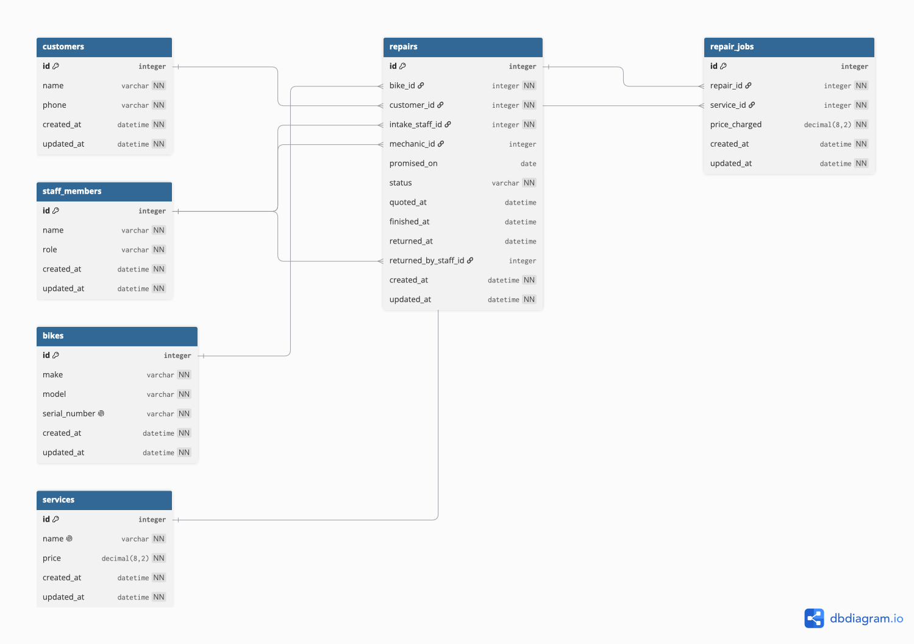

# Domain Model

## Diagram



> **Note:** the image above is the Lab 3 export. The DBML below is the
> up-to-date source — paste it into [dbdiagram.io](https://dbdiagram.io) and
> re-export `images/dbdiagram.png` so the picture matches the code again.

## DBML

```dbml
Table customers {
  id integer [pk, increment]
  name varchar [not null]
  phone varchar [not null]
  created_at datetime [not null]
  updated_at datetime [not null]
}

Table staff_members {
  id integer [pk, increment]
  name varchar [not null]
  role varchar [not null, note: 'mechanic / receptionist / owner — plain string today, no DB-level enum until Lab 7 validations exist']
  created_at datetime [not null]
  updated_at datetime [not null]
}

Table bikes {
  id integer [pk, increment]
  make varchar [not null]
  model varchar [not null]
  serial_number varchar [not null, unique, note: 'prevents the March mix-up: identifies the physical bike, not just make+model+colour']
  created_at datetime [not null]
  updated_at datetime [not null]
}

Table services {
  id integer [pk, increment]
  name varchar [not null, unique]
  price decimal(8,2) [not null, note: 'current wall-list price; changes each January']
  created_at datetime [not null]
  updated_at datetime [not null]
}

Table repairs {
  id integer [pk, increment]
  bike_id integer [ref: > bikes.id, not null]
  customer_id integer [ref: > customers.id, not null, note: 'the customer who dropped the bike off this time']
  intake_staff_id integer [ref: > staff_members.id, not null]
  mechanic_id integer [ref: > staff_members.id, note: 'assigned once diagnosis starts']
  promised_on date
  status varchar [not null, default: 'dropped_off', note: 'dropped_off / diagnosing / awaiting_approval / in_progress / declined_pickup_pending / ready_for_pickup / picked_up — plain string today, no DB-level enum until Lab 7']
  quoted_at datetime
  finished_at datetime
  returned_at datetime
  returned_by_staff_id integer [ref: > staff_members.id]
  created_at datetime [not null]
  updated_at datetime [not null]
}

Table repair_jobs {
  id integer [pk, increment]
  repair_id integer [ref: > repairs.id, not null]
  service_id integer [ref: > services.id, not null]
  price_charged decimal(8,2) [not null, note: 'snapshot of the price at the time of this repair — never recalculated from services.price']
  created_at datetime [not null]
  updated_at datetime [not null]
}
```

> `photos` (Lab 3, User story 3) is not in the schema yet. Lab 5 explicitly
> postpones photos and the written diagnosis to Lab 9, since both bring
> their own storage concerns that aren't modelled here.

## Changes since Lab 3

- **`job_catalog` renamed to `services`** (and `repair_jobs.job_catalog_id` renamed to `service_id`). Lab 4 and Lab 5 both call it "the services page" / "the services table"; Rails convention names a table after the plural of the model it holds (one row is a `Service`), not a container noun like "catalog".
- **`repairs.promised_date` renamed to `promised_on`.** Rails convention: a `date` column ends in `_on`, an instant (`datetime`) ends in `_at`. This column holds a day, not a moment.
- **`photos` removed for now.** Lab 5 explicitly says photos (and the written diagnosis) arrive in Lab 9 with their own table — starting them today means starting them twice.
- **`repairs.diagnosis` removed for now.** Same reason as `photos` — it comes back in Lab 9.
- **`staff_role` and `repair_status` are no longer DB-level enum types.** They're plain `varchar` columns (`staff_members.role`, `repairs.status`) with no value restriction. Lab 5 forbids enums (and every other validation) inside models, and there's no validation layer yet to enforce which strings are legal — that constraint is deferred to Lab 7.
- **`services.price` and `repair_jobs.price_charged` now declare precision and scale** (`decimal(8,2)`) instead of a bare `decimal`. Lab 5 requires money columns to state precision/scale explicitly.
- **`created_at`/`updated_at` added to every table**, replacing the ad-hoc `repairs.created_at [default: now()]` from Lab 3. Lab 5 requires the standard Rails timestamp pair everywhere; Active Record sets both on save, so no DB-level default is needed.
- **Every `_id` column (`bike_id`, `customer_id`, `intake_staff_id`, `mechanic_id`, `repair_id`, `service_id`, `returned_by_staff_id`) is a plain indexed column with no foreign key constraint in the database.** The `ref:` arrows above are still the conceptual relationships; the actual constraint — and the Active Record association that uses it — is Lab 7.

## Lifecycle

`repairs.status` is the lifecycle of a single repair, from the bike arriving to the bike leaving.

**Allowed transitions:**

- `dropped_off` → `diagnosing` — the mechanic starts looking at the bike.
- `diagnosing` → `ready_for_pickup` — shortcut for a simple same-day job (e.g. a flat tyre), no quote needed (user story 5).
- `diagnosing` → `awaiting_approval` — a bigger job: the customer is called with a price (user story 6.1).
- `awaiting_approval` → `in_progress` — the customer approves the quote (user story 6.2).
- `awaiting_approval` → `declined_pickup_pending` — the customer declines the quote (user story 6.2 / 10).
- `in_progress` → `ready_for_pickup` — the mechanic finishes the approved jobs (user story 8).
- `ready_for_pickup` → `picked_up` (user story 9 / 10).
- `declined_pickup_pending` → `picked_up` — no work was performed (user story 10).

**Transitions that are explicitly not allowed:**

- `dropped_off` → `ready_for_pickup`. A bike cannot skip diagnosis.
- `awaiting_approval` → `ready_for_pickup` or `awaiting_approval` → `in_progress` without the customer's decision being recorded. Work cannot start or finish on an unapproved quote.
- `declined_pickup_pending` → `in_progress`. Once a customer has declined, the shop cannot resume work without a new quote-and-approval cycle (a fresh pass through `diagnosing` → `awaiting_approval`).
- `picked_up` → any other state. `picked_up` is terminal — a bike that comes back for a new problem gets a new `repairs` row, it does not reopen the old one.

## Every entity traces back to a story

| Entity | Required by |
|---|---|
| `customers` | User story 1 — a customer's name and phone are recorded and tied to the bike at drop-off |
| `staff_members` | User story 8 — a mechanic records which jobs *they* performed; each of the three mechanics is a distinct actor, not an anonymous "staff" flag |
| `bikes` | User story 2 — make, model and serial number, kept as one row per physical bike |
| `services` | User story 15 — the wall list of jobs and prices, published on the website |
| `repairs` | User story 1 — created the moment a bike is dropped off; carries the promised date and status through the rest of the stories |
| `repair_jobs` | User story 8 — the specific jobs applied to one repair, at the price actually charged |

`photos` (user story 3) isn't a table yet — see "Changes since Lab 3" above.

## Two decisions

**The thing and the copy of the thing.** `bikes` has no quantity column and no "model" table shared across physical bikes — every bike is its own row, identified by a unique `serial_number`. That is exactly what prevents the mix-up from March: a table like `bike_models { make, model, colour, quantity }` can tell you the shop has handled two blue Trek Marlins, but it cannot tell you which specific one is on the rack, which one belongs to which ticket, or which one had its fork replaced last year — the individual bike has a history, so it has to be an entity, not a count.

**Derived, or stored?** Whether a repair is overdue is never stored: it's computed as `promised_on < today AND status not in (ready_for_pickup, picked_up)`, exactly like the owner's "call them before they call me" list. Storing an `overdue` flag would let it go stale the moment midnight passes without anyone touching the row. What we do store, even though it looks derivable, is `repair_jobs.price_charged`. It looks like it should just be `services.price` at read time — but `services.price` changes every January, and it is not versioned. If we didn't snapshot the price into `repair_jobs`, every invoice from last year would silently reprice itself the day the wall list changes, and there would be no way to represent a discount given to a regular customer at all.
