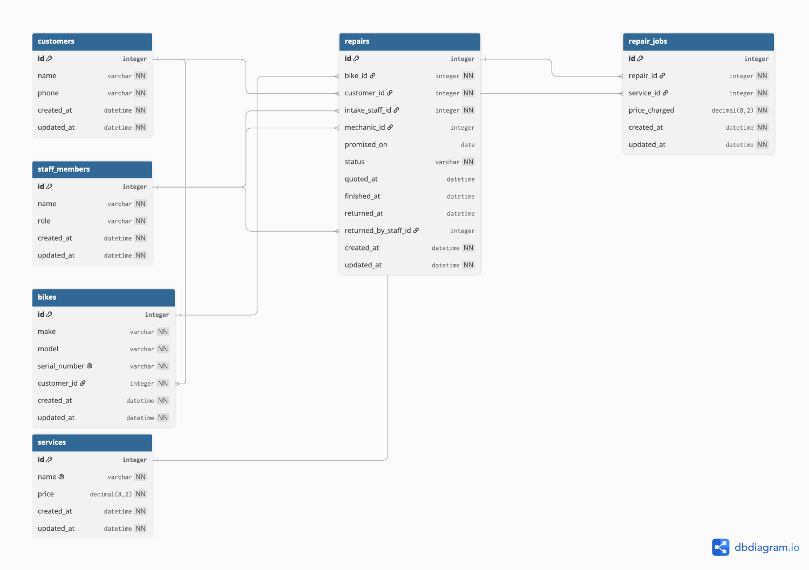

# Domain Model

## Diagram



> **Note:** the image above is the Lab 3 export. The DBML below is the
> up-to-date source — paste it into [dbdiagram.io](https://dbdiagram.io) and
> re-export `images/dbdiagram.png` so the picture matches the code again.

## DBML

```dbml
Table customers {
  id integer [pk, increment]
  name varchar [not null]
  phone varchar [not null]
  created_at datetime [not null]
  updated_at datetime [not null]
}

Table staff_members {
  id integer [pk, increment]
  name varchar [not null]
  role varchar [not null, note: 'mechanic / receptionist / owner — plain string today, no DB-level enum until Lab 7 validations exist']
  created_at datetime [not null]
  updated_at datetime [not null]
}

Table bikes {
  id integer [pk, increment]
  make varchar [not null]
  model varchar [not null]
  serial_number varchar [not null, unique, note: 'prevents the March mix-up: identifies the physical bike, not just make+model+colour']
  customer_id integer [ref: > customers.id, not null, note: 'owner of the bike, stored directly as of Lab 6 -- see Changes since Lab 3']
  created_at datetime [not null]
  updated_at datetime [not null]
}

Table services {
  id integer [pk, increment]
  name varchar [not null, unique]
  price decimal(8,2) [not null, note: 'current wall-list price; changes each January']
  created_at datetime [not null]
  updated_at datetime [not null]
}

Table repairs {
  id integer [pk, increment]
  bike_id integer [ref: > bikes.id, not null]
  customer_id integer [ref: > customers.id, not null, note: 'the customer who dropped the bike off this time']
  intake_staff_id integer [ref: > staff_members.id, not null]
  mechanic_id integer [ref: > staff_members.id, note: 'assigned once diagnosis starts']
  promised_on date
  status varchar [not null, default: 'dropped_off', note: 'dropped_off / diagnosing / awaiting_approval / in_progress / declined_pickup_pending / ready_for_pickup / picked_up — plain string today, no DB-level enum until Lab 7']
  quoted_at datetime
  finished_at datetime
  returned_at datetime
  returned_by_staff_id integer [ref: > staff_members.id]
  created_at datetime [not null]
  updated_at datetime [not null]
}

Table repair_jobs {
  id integer [pk, increment]
  repair_id integer [ref: > repairs.id, not null]
  service_id integer [ref: > services.id, not null]
  price_charged decimal(8,2) [not null, note: 'snapshot of the price at the time of this repair — never recalculated from services.price']
  created_at datetime [not null]
  updated_at datetime [not null]
}
```

> `photos` (Lab 3, User story 3) is not in the schema yet. Lab 5 explicitly
> postpones photos and the written diagnosis to Lab 9, since both bring
> their own storage concerns that aren't modelled here.

## Changes since Lab 3

- **`job_catalog` renamed to `services`** (and `repair_jobs.job_catalog_id` renamed to `service_id`). Lab 4 and Lab 5 both call it "the services page" / "the services table"; Rails convention names a table after the plural of the model it holds (one row is a `Service`), not a container noun like "catalog".
- **`repairs.promised_date` renamed to `promised_on`.** Rails convention: a `date` column ends in `_on`, an instant (`datetime`) ends in `_at`. This column holds a day, not a moment.
- **`photos` removed for now.** Lab 5 explicitly says photos (and the written diagnosis) arrive in Lab 9 with their own table — starting them today means starting them twice.
- **`repairs.diagnosis` removed for now.** Same reason as `photos` — it comes back in Lab 9.
- **`staff_role` and `repair_status` are no longer DB-level enum types.** They're plain `varchar` columns (`staff_members.role`, `repairs.status`) with no value restriction. Lab 5 forbids enums (and every other validation) inside models, and there's no validation layer yet to enforce which strings are legal — that constraint is deferred to Lab 7.
- **`services.price` and `repair_jobs.price_charged` now declare precision and scale** (`decimal(8,2)`) instead of a bare `decimal`. Lab 5 requires money columns to state precision/scale explicitly.
- **`created_at`/`updated_at` added to every table**, replacing the ad-hoc `repairs.created_at [default: now()]` from Lab 3. Lab 5 requires the standard Rails timestamp pair everywhere; Active Record sets both on save, so no DB-level default is needed.
- **Every `_id` column (`bike_id`, `customer_id`, `intake_staff_id`, `mechanic_id`, `repair_id`, `service_id`, `returned_by_staff_id`) is a plain indexed column with no foreign key constraint in the database.** The `ref:` arrows above are still the conceptual relationships; the actual constraint — and the Active Record association that uses it — is Lab 7.

## Changes since Lab 5

- **Every `_id` column now has a real foreign key constraint** (Lab 6), enforced by PostgreSQL, and every model declares the matching `belongs_to` / `has_many` pair. No validations, scopes, callbacks or enums — those are still later labs.
- **`bikes.customer_id` added, `NOT NULL`, with its own foreign key to `customers`.** Lab 3 deliberately left this out and inferred the current owner from the `customer_id` on the bike's most recent `repair` (see `docs/decisions.md`, question 3), to avoid modelling something the description never asked for. Lab 6 needs a bike's owner and a customer's bikes to be a plain association walked with no `where`, which a derived read of the latest repair can't be — an actual `has_many`/`belongs_to` pair needs a column. This keeps the same assumption as before (no formal ownership transfer, one owner for the bike's life in the system), it just stores that owner instead of recomputing it on every read. `repairs.customer_id` is unchanged and still answers a different question: who dropped this bike off *this time*, which in principle could differ from the bike's registered owner.

## Changes since Lab 6

- **Every `has_many` declares a `dependent:` option**, except `Customer#bikes` and `Service#repair_jobs`: a customer who owns a bike, or a service charged on a repair, cannot be destroyed at all — a `before_destroy` callback adds a counter-friendly message to `errors` and aborts, rather than letting Postgres or a generic `dependent:` message speak for it.
- **`has_many :through` added**: `Repair#services` and `Service#repairs` (through `repair_jobs`), and `Customer#repairs_through_bikes` (through `bikes`) — a second, distinct path from `Customer#repairs` (who dropped the bike off *this* time) to the repairs on the bikes a customer owns.
- **Validations**: `presence` on every `NOT NULL` column, `uniqueness` on `bikes.serial_number` and `services.name`, `numericality` (`greater_than: 0`) on `services.price` and `repair_jobs.price_charged`, plus two custom validations on `Repair` — a promised or returned day can't be before the day the bike was dropped off, and `in_progress` / `declined_pickup_pending` require `quoted_at` to be set.
- **`repairs.status` is now an `enum`** (string values, matching the lifecycle above) — no state name appears as a string literal anywhere else in the app.
- **Scopes replace every `order` and the date comparison that used to live in a helper**: `newest_first`, `by_name`, `by_make_and_model`, `by_role_and_name` per model, plus `Repair.open` / `Repair.overdue` and the instance methods `Repair#overdue?` and `Repair#total`.
- **`bikes.serial_number` is normalised (`strip` + `upcase`) in a `before_validation` callback**, so `" wtu123 "` and `"WTU123"` are the same bike for the unique index and the uniqueness validation; `services.name` gets the same `strip` treatment.
- **Every `index` and `show` eager-loads what its view renders**, via `includes` in the controller — no change to the views themselves.

## Changes since Lab 7

No change to the schema: Lab 8 adds no migration. What changed is how records are written.

Every record can be created, edited and deleted from the browser:

- **One form per resource** (`app/views/<resource>/_form.html.erb`), built with `form_with` bound to the record and shared by `new` and `edit`. Every `belongs_to` is a select that shows the parent by name; a repair's state is a select built from the enum, and so is a staff member's role.
- **Strong parameters**: each controller has one private `<resource>_params` method using `params.expect`. A request with no key for the resource answers `400 Bad Request`.
- **A repair's form writes two tables** in one save through `accepts_nested_attributes_for :repair_jobs`: each line picks a service and the price charged that day. It works without JavaScript — a new repair offers 3 empty lines and every edit adds 2 more (save and edit again to add more); a line left without a service is ignored, and an existing line is removed with its "Remove this line" box. The repair's customer isn't asked for: it's taken from the bike's owner.
- **After a valid write** the app redirects to the record (or to the index after a delete) with a flash message naming it, drawn once by the layout.
- **After a refused write** the same form is rendered again with status `422`, the typed values kept, a summary of every error at the top and each invalid field marked with Bootstrap's `is-invalid` state. Rails' `field_with_errors` wrapper is turned off in `config/initializers/field_error_proc.rb`.
- **Deleting** is a button on every record's page that asks for confirmation first. A customer who owns a bike, a service already charged on a repair, a bike with repairs and a staff member with repairs refuse to be deleted, and the page says why.
- Bikes can be added from a customer's page and repairs taken in from a bike's page, with the parent already chosen.

## Changes since Lab 8

Lab 9 brings back the two things Lab 5 postponed — the intake photos and the written diagnosis — but not as they were drawn in Lab 3. **This supersedes three statements above, which are left as they were written at the time:** the note under the DBML ("`photos` … is not in the schema yet"), the lines "`photos` removed for now" and "`repairs.diagnosis` removed for now" in *Changes since Lab 3*, and the line under the traceability table ("`photos` (user story 3) isn't a table yet").

- **No `photos` table of our own, and no `repairs.diagnosis` column.** Lab 3 drew `photos (repair_id, image_url)` and a `diagnosis` column on `repairs`. Neither exists: `repairs` gets **no new column**.
- **The photos live in Active Storage's three tables**, created by `bin/rails active_storage:install`: `active_storage_blobs` (one row per file: key, filename, content type, size, checksum), `active_storage_attachments` (the polymorphic join: `record_type = 'Repair'`, `record_id`, `name = 'photos'`, `blob_id`) and `active_storage_variant_records` (one row per generated thumbnail). `Repair` declares `has_many_attached :photos`, so a repair still has many photos, as user story 3 asked, and each photo still belongs to one repair — through `active_storage_attachments.record_id` instead of a `photos.repair_id`. `image_url` is gone: the URL is generated from the blob, never stored.
- **The diagnosis lives in Action Text's table** `action_text_rich_texts` (`record_type = 'Repair'`, `record_id`, `name = 'diagnosis'`, `body`), created by `bin/rails action_text:install`. `Repair` declares `has_rich_text :diagnosis`. It is formatted text (bold, lists, links, quotes), not the plain string Lab 3 drew.
- **These four tables belong to Rails, not to the shop's domain**, so they are not added to the diagram above: the diagram keeps the domain entities. They appear in `db/schema.rb`.
- **Traceability:** the intake photos answer user story 3, as the `photos` table did in Lab 3; the diagnosis is what the mechanic writes while the repair is `diagnosing` (see the lifecycle below).

A repair carries the photos taken when the bike came in and the mechanic's diagnosis, as formatted text. Neither is a column of `repairs`: the photos live in Active Storage's tables and the diagnosis in Action Text's.

- **Photos** (`has_many_attached :photos` on `Repair`) are chosen in the repair's form, several at once. On edit, the files chosen are **added** to the photos the repair has (the form sends the existing ones back as hidden signed ids); saving without choosing a file leaves them as they were.
- **Accepted files:** JPEG, PNG, HEIC/HEIF and WebP — what the shop's phones and screenshots produce — up to **10 MB** each. Both rules are validations on `Repair`, checked against the type Active Storage detects from the file's bytes (not its name or the browser's claim). A refused upload answers `422`, names the file under the field, and attaches **none** of the files sent with it.
- **Removing a photo**: each photo on the repair's page and on its edit page has a *Remove* button (a `DELETE` with a confirmation). It purges that photo's attachment and blob and leaves the others. Destroying a repair purges its photos and deletes its diagnosis.
- **Thumbnails**: two named variants, declared in `app/models/repair.rb` and nowhere else — `:thumb`, an 80 × 80 square crop for the rows of every list of repairs, and `:large`, at most 1000 px, for the repair's page. Lists never download an original; clicking a photo opens it. Files are served through Active Storage's proxy routes (`config/application.rb`), so a variant's URL never expires and the browser caches it.
- **Diagnosis** (`has_rich_text :diagnosis`): written in the Trix editor, printed on the repair's page with its formatting through Action Text, and shown in each row as the first 60 characters of its plain text. It is optional. Nothing written by a person is printed with `raw` or `html_safe`; Action Text strips scripts and event handlers.
- **Queries**: every list of repairs and the repair's page preload the photos, their variants and the diagnosis in the controller (`with_attached_photos`, `with_rich_text_diagnosis_and_embeds`), so the number of queries doesn't depend on the number of repairs or photos.

## Lifecycle

`repairs.status` is the lifecycle of a single repair, from the bike arriving to the bike leaving.

**Allowed transitions:**

- `dropped_off` → `diagnosing` — the mechanic starts looking at the bike.
- `diagnosing` → `ready_for_pickup` — shortcut for a simple same-day job (e.g. a flat tyre), no quote needed (user story 5).
- `diagnosing` → `awaiting_approval` — a bigger job: the customer is called with a price (user story 6.1).
- `awaiting_approval` → `in_progress` — the customer approves the quote (user story 6.2).
- `awaiting_approval` → `declined_pickup_pending` — the customer declines the quote (user story 6.2 / 10).
- `in_progress` → `ready_for_pickup` — the mechanic finishes the approved jobs (user story 8).
- `ready_for_pickup` → `picked_up` (user story 9 / 10).
- `declined_pickup_pending` → `picked_up` — no work was performed (user story 10).

**Transitions that are explicitly not allowed:**

- `dropped_off` → `ready_for_pickup`. A bike cannot skip diagnosis.
- `awaiting_approval` → `ready_for_pickup` or `awaiting_approval` → `in_progress` without the customer's decision being recorded. Work cannot start or finish on an unapproved quote.
- `declined_pickup_pending` → `in_progress`. Once a customer has declined, the shop cannot resume work without a new quote-and-approval cycle (a fresh pass through `diagnosing` → `awaiting_approval`).
- `picked_up` → any other state. `picked_up` is terminal — a bike that comes back for a new problem gets a new `repairs` row, it does not reopen the old one.

## Every entity traces back to a story

| Entity | Required by |
|---|---|
| `customers` | User story 1 — a customer's name and phone are recorded and tied to the bike at drop-off |
| `staff_members` | User story 8 — a mechanic records which jobs *they* performed; each of the three mechanics is a distinct actor, not an anonymous "staff" flag |
| `bikes` | User story 2 — make, model and serial number, kept as one row per physical bike |
| `services` | User story 15 — the wall list of jobs and prices, published on the website |
| `repairs` | User story 1 — created the moment a bike is dropped off; carries the promised date and status through the rest of the stories |
| `repair_jobs` | User story 8 — the specific jobs applied to one repair, at the price actually charged |

`photos` (user story 3) isn't a table yet — see "Changes since Lab 3" above.

## Two decisions

**The thing and the copy of the thing.** `bikes` has no quantity column and no "model" table shared across physical bikes — every bike is its own row, identified by a unique `serial_number`. That is exactly what prevents the mix-up from March: a table like `bike_models { make, model, colour, quantity }` can tell you the shop has handled two blue Trek Marlins, but it cannot tell you which specific one is on the rack, which one belongs to which ticket, or which one had its fork replaced last year — the individual bike has a history, so it has to be an entity, not a count.

**Derived, or stored?** Whether a repair is overdue is never stored: it's computed as `promised_on < today AND status not in (ready_for_pickup, picked_up)`, exactly like the owner's "call them before they call me" list. Storing an `overdue` flag would let it go stale the moment midnight passes without anyone touching the row. What we do store, even though it looks derivable, is `repair_jobs.price_charged`. It looks like it should just be `services.price` at read time — but `services.price` changes every January, and it is not versioned. If we didn't snapshot the price into `repair_jobs`, every invoice from last year would silently reprice itself the day the wall list changes, and there would be no way to represent a discount given to a regular customer at all.
