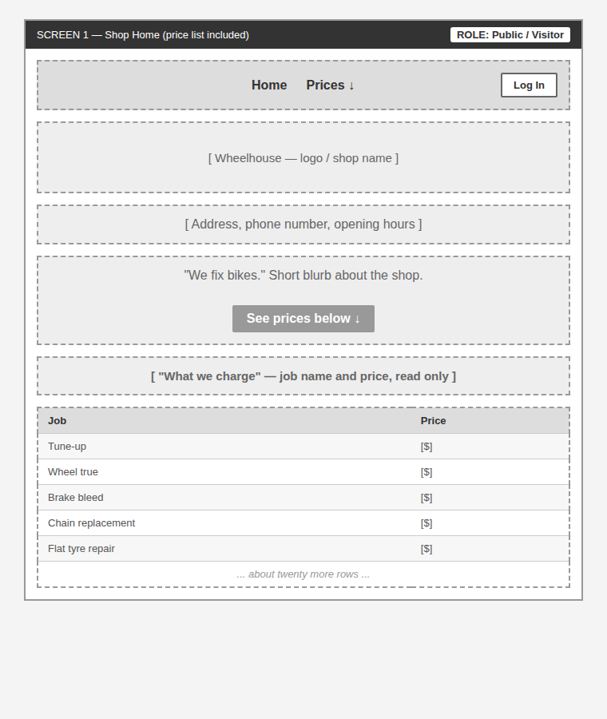
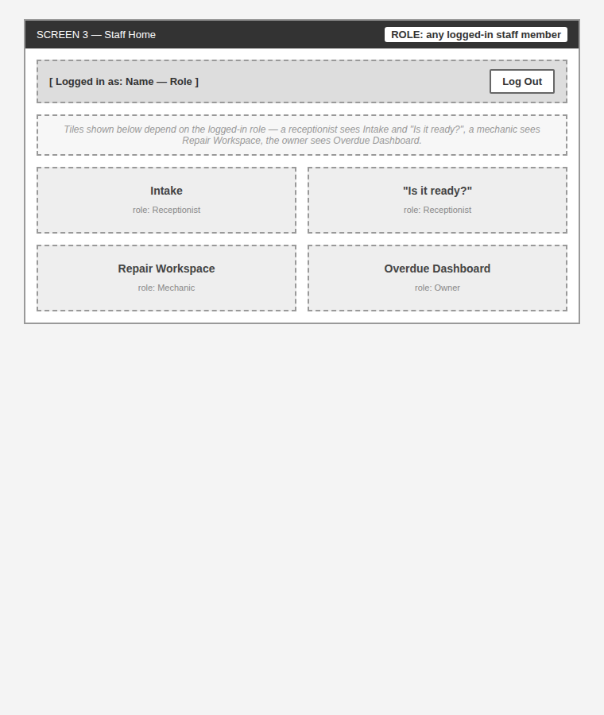
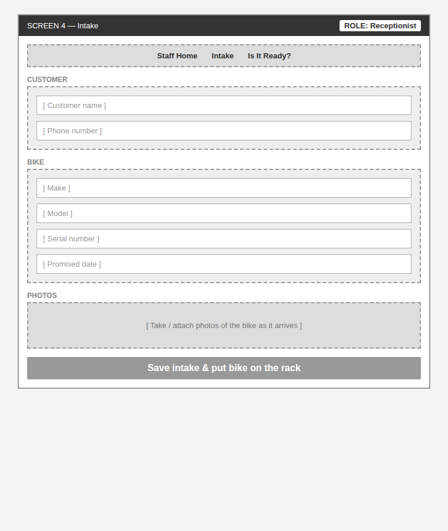
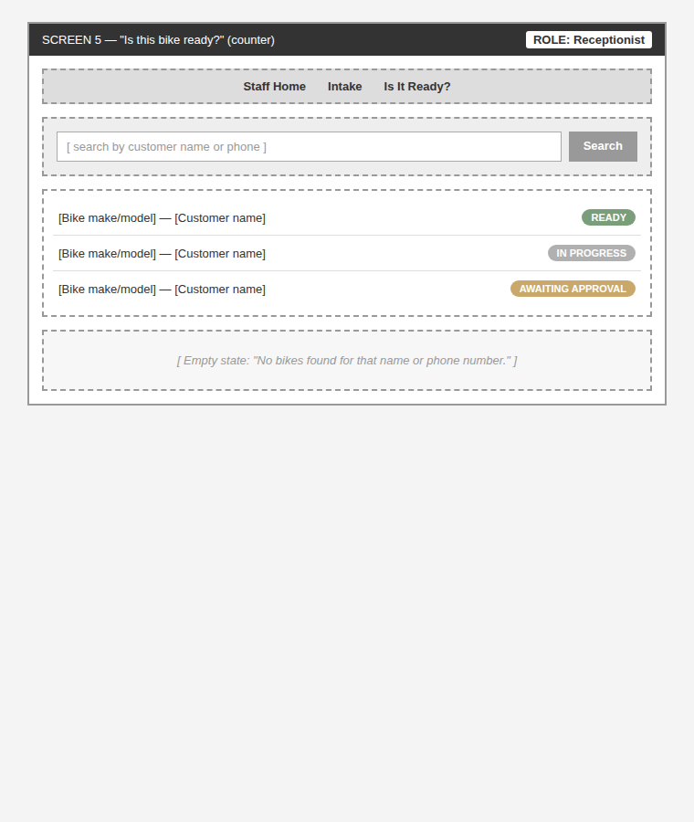
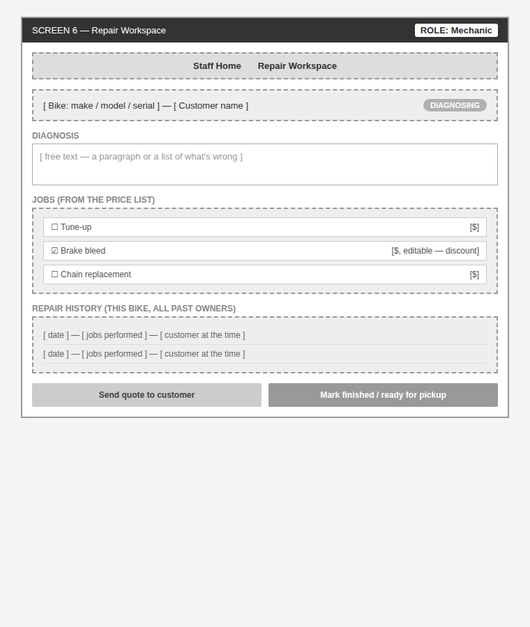
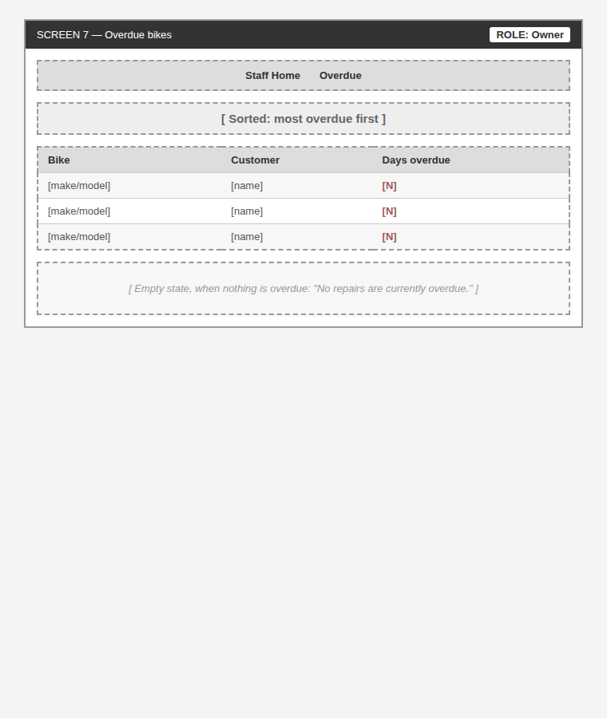
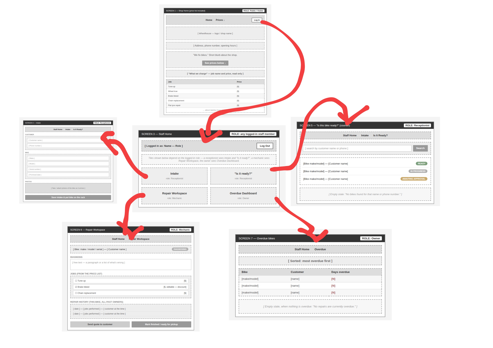

# Wireframes

Six low-fidelity screens (grey boxes, no visual design), each naming the role looking at it, followed by the navigation graph between all of them.

## 1. Shop Home (price list included)

**Role: Public / Visitor**

The public landing page. No login required. The wall list of jobs and prices is published directly on this page — no separate page to navigate to — so people stop calling to ask what a tune-up costs. A **Log In** button sits in the top-right corner for staff.

## 2. Staff Home

**Role: any logged-in staff member**

The landing screen after logging in. What it links to depends on the logged-in role: a receptionist sees Intake and "Is it ready?", a mechanic sees the Repair Workspace, the owner sees the Overdue Dashboard.

## 3. Intake

**Role: Receptionist**

Where a bike gets recorded the moment it's dropped off: customer name and phone, bike make/model/serial number, promised date, and photos of the bike as it arrives.

## 4. "Is it ready?" (counter screen)

**Role: Receptionist**

The screen that replaces the walk to the back of the shop. Search by customer name or phone, see every bike's status at a glance, with an explicit empty state when there's no match.

## 5. Repair Workspace

**Role: Mechanic**

Where a mechanic writes the diagnosis, selects jobs from the price list (price editable per job for a discount), reviews the bike's repair history across all of its past owners, and marks the repair finished or sends it out for a customer quote.

## 6. Overdue Dashboard

**Role: Owner**

Bikes whose promised day has passed and are not yet finished, most overdue first, so the owner can call the customer before the customer calls them. Explicit empty state when nothing is overdue.

## Navigation graph

- **Public zone** (no login): just Shop Home — the price list lives on that same page, so there's nothing else to navigate to before logging in.
- **Log In** takes a staff member from Shop Home into the **Staff zone**, landing on Staff Home, whose content depends on the logged-in role.
- **Staff zone**: Staff Home ⇄ Intake (Receptionist), Staff Home ⇄ "Is it ready?" (Receptionist), Staff Home ⇄ Repair Workspace (Mechanic), Staff Home ⇄ Overdue Dashboard (Owner).
- From "Is it ready?" and from the Overdue Dashboard, a specific bike can be opened directly in the Repair Workspace.

Every screen is reachable from Shop Home, and every screen has at least one way back out — no dead ends.

